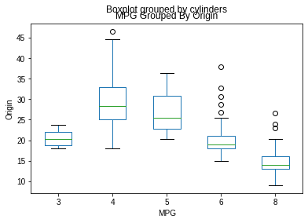
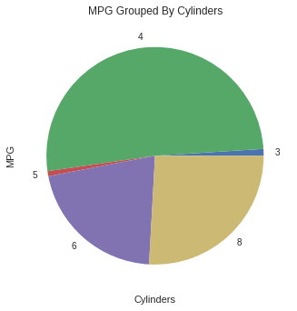
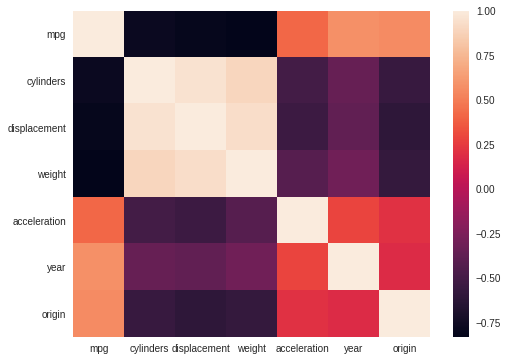
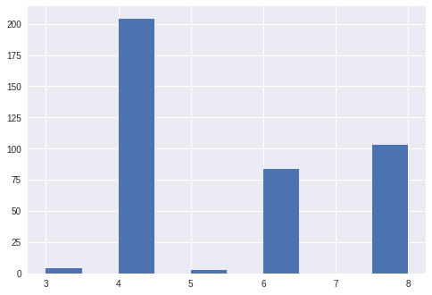
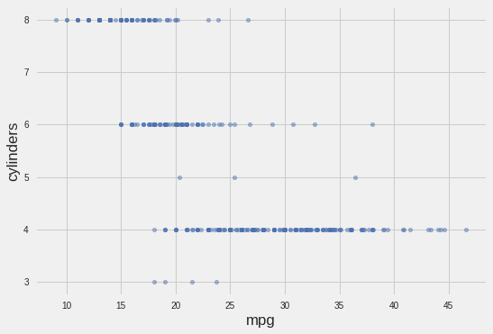
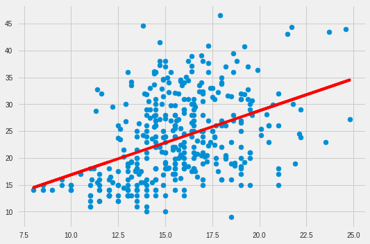

# Data Manipulation and Machine Learning Using Pandas-Python

## Introduction
Pandas is an open source Python package that is mostly used for data science/data analysis. It is built on top of the Numpy package. More information regarding the pandas package can be found [*here*](https://www.activestate.com/resources/quick-reads/what-is-pandas-in-python-everything-you-need-to-know/). This repository will cover several usage examples of the pandas package and at the end it will demonstrate the run of a machine learning model. 

## Details of the Jupyter Notebook File
It is important to note that on top of the file you will see the imported libraries or packages. They usually are located at the top of the file.   
The **os** package it is used for changing directory to current directy, listing all the files in current directory, and get current directory. 

The **pandas** package it is used throughout this notebook in order to perform different data manipulation. First, the csv data file is read as a dataframe or df.  
df.head() will display first 5 rows of the file and all the corresponding columns.  
df.info() will display information pertaining to the data such as the type of each column, number of rows, etc.  
df.shape() will display the shape of the data in this case output will be (398, 9).  
df.describe() will display each column with specific information such as count, mean, std, min, max, etc for each column or feature.  
df.insert(9,'test',(df['mpg']/df['cylinders']).astype(float)) will insert a new column called test as float on column index 9.  
df.columns will display all the columns of the dataframe.  
df.sort_values('cylinders', ascending = False) will sort the dataframe by cylinders in descending order.  
df[df['mpg'] > 20] will display filtered dataframe for mpg values > 20.  
df.drop_duplicates(subset='name') will drop any duplicate values in the column name.  
df[df['name'].isin(['vw rabbit custom', 'amc concord'])] will provide a filtered dataframe of all the rows containing vw rabbit custom and amc concord under name column.  
df.isna().any() will display all the columns of the dataframe and a new column with eithe True of False if any row is empty or NA.  

## Different Type of Plots
The fist plot in the notebook is a box plot that will depict the cylinder column for each mpg column. A box plot is a method for graphically depicting groups of numerical data through their quartiles. The box extends from the Q1 to Q3 quartile values of the data, with a line at the median (Q2). 

The image below shows a pie plot. It is grouped by cylinders and it groups all of the mpg counts for each cyclinder count. A pie plot is a proportional representation of the numerical data in a column.  

The image below shows a heatmap of all the data features. A heatmap contains values representing various shades of the same color for each value to be plotted. Usually the darker shades of the chart represent higher values than the lighter shade. The varying intensity of color represents the measure of correlation.  

The image below will show a histogram plot of the cylinder feature.  

The image below will show a scatter plot of cylinders vs. mpg columns.  

The image below shows a linear regression plot with x data the acceleration column and y data the mpg column.  

https://prespafree1.github.io/Data-Manipulation-and-Machine-Learning-Using-Pandas-Python/

